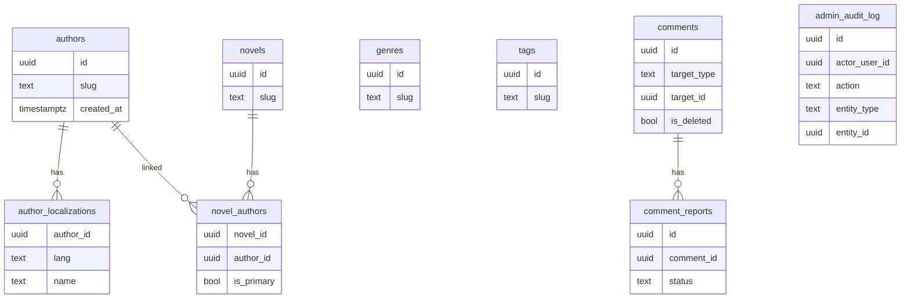

# Полнофункциональная админка: страницы + API + модели

## Что уже есть (база для расширения)

- **Бэкенд**: есть группа `r.Route("/admin", ...)` под `RequireRole("admin")` в [`backend/internal/http/routes/router.go`](/home/fsociety/novels/backend/internal/http/routes/router.go) и уже реализованы админ‑эндпоинты для новелл/глав/загрузки/билетов/подписок/featured‑коллекций/новостей.
- **БД**: жанры/теги уже в `001_initial_schema.sql` (таблицы `genres`, `genre_localizations`, `tags`, `tag_localizations`, связки `novel_genres`, `novel_tags`).
- **Фронт**: есть `AdminDashboard` и страницы для `/admin/novels`, `/admin/chapters`, `/admin/moderation`, но остальные ссылки ведут на **несуществующие маршруты Next.js** → 404.

## Критично исправить перед реализацией админ‑страниц

- **Единые права доступа**: вы выбрали **admin_only**. Сейчас часть админ‑страниц на фронте проверяет `isModerator(...)`. Нужно привести всё к **isAdmin(...)** (и сделать редирект в `useEffect`, как на странице модерации), чтобы:
  - не было React warning про `router.push` во время render
  - фронт соответствовал бэку (где `/api/v1/admin/*` уже admin‑only)

- **Схема comments/reports**: текущие миграции создают `comments`/`comment_reports` в одном формате, а Go‑код (`CommentRepository`) ожидает другой (поля `target_type`, `target_id`, `body`, `is_deleted` и т.д.). Для “полной функциональности” страниц `/admin/comments` и `/admin/reports` нужно:
  - добавить миграцию, которая приведёт таблицы к схеме, используемой кодом
  - (или наоборот) откатить код к старой схеме — но это ломает уже написанные хендлеры. В плане закладываю **приведение БД к текущему коду**.

## Целевая модель данных (ключевые связи)

## Бэкенд: DB миграции

Добавляем новые миграции в [`backend/internal/database/migrations/`](/home/fsociety/novels/backend/internal/database/migrations/) (они применяются через embed в `database.RunMigrations`).

- **006_authors.sql**
  - `authors` + `author_localizations`
  - `novel_authors` (многие‑ко‑многим, `is_primary`)
  - индексы по `slug`, `(author_id,lang)`, `(novel_id,author_id)`

- **007_comments_unify.sql**
  - миграция `comments` к схеме, которую использует `CommentRepository` и `models.Comment`:
    - `target_type` (enum или text), `target_id`, `body`, `is_deleted`, `is_spoiler`, `likes_count`, `dislikes_count`, `replies_count`, `parent_id`, `root_id`, `depth`
  - миграция `comment_reports` (если нужно) к полям из `models.CommentReport`
  - безопасная миграция данных из старых колонок (`content`, `novel_id/chapter_id`) → `target_type/target_id/body`

- **008_admin_settings_and_audit.sql**
  - `app_settings(key,value,updated_by,updated_at)`
  - `admin_audit_log(...)` (для `/admin/logs`)

## Бэкенд: новые модели/репозитории/сервисы/хендлеры

### 1) Справочники: жанры/теги

- **Новые admin endpoints** (в группе `/api/v1/admin`):
  - `GET /genres` (поиск/пагинация)
  - `POST /genres` (создание + локализации)
  - `PUT /genres/{id}`
  - `DELETE /genres/{id}` (с проверкой связей)
  - аналогично для `tags`
- Реализация: `repository/genre_repository.go`, `service/genre_service.go`, `handlers/genre_admin_handler.go` (или расширить `AdminHandler`, но лучше разделить по сущностям).

### 2) Авторы (полноценная сущность)

- **Новые admin endpoints**:
  - `GET /authors`
  - `POST /authors`
  - `PUT /authors/{id}`
  - `DELETE /authors/{id}`
  - `GET /novels/{id}/authors` и `PUT /novels/{id}/authors` (привязка авторов к новелле)
- Обновления новелл:
  - расширить `models.CreateNovelRequest`/`UpdateNovelRequest` (например `authorIds`/`authors`), и обновить `NovelService`/`NovelRepository` чтобы сохранять связи `novel_authors`.

### 3) Пользователи

- **admin endpoints**:
  - `GET /users` (пагинация, поиск по email/display_name, фильтр banned)
  - `GET /users/{id}` (детали)
  - `POST /users/{id}/ban` / `POST /users/{id}/unban`
  - `PUT /users/{id}/roles` (назначение ролей)

### 4) Комментарии и жалобы

- **admin endpoints**:
  - `GET /comments` (фильтры `target_type/target_id/user_id/is_deleted`, пагинация)
  - `POST /comments/{id}/soft-delete` (или `DELETE`)
  - `DELETE /comments/{id}/hard` (жёсткое удаление)
  - `GET /reports` (список `comment_reports` по статусу)
  - `POST /reports/{id}/resolve` / `.../dismiss`

### 5) Новости

- Бэкенд **уже** поддерживает `/api/v1/admin/news*`.
- Нужно только привести фронт к этим эндпоинтам и сделать UI CRUD.

### 6) Настройки / Логи / Статистика / Популярное

- **Settings**: CRUD по `app_settings` (минимум: `GET /settings`, `PUT /settings/{key}`), плюс аудит.
- **Logs**: `GET /logs` (фильтры по actor/action/entity/date).
- **Stats**:
  - использовать уже имеющиеся `platform_stats` (из `004_community.sql`) и/или агрегаты по новеллам/комментам/пользователям.
  - endpoint `GET /admin/stats/overview`.
- **Popular**:
  - endpoint `GET /admin/novels/popular` (прокси к `NovelService.GetPopular/GetTrending/GetTopRated`) + возможное управление “ручным” featured через коллекции (у вас уже есть `SetFeatured`).

## Фронтенд: страницы Next.js (устранение 404 + полноценный UI)

Создать страницы в [`frontend/src/app/[locale]/admin/`](/home/fsociety/novels/frontend/src/app/[locale]/admin/) для:

- `genres`, `tags`, `authors`, `reports`, `comments`, `users`, `news`, `settings`, `logs`, `stats`, `popular`

Общий подход:

- **Единый guard admin_only** (хук/компонент): проверка `isAuthenticated && isAdmin(user)` + редирект через `useEffect` и `router.replace`.
- **React Query** для списков/мутаций (как в `admin/moderation/page.tsx`).
- **UI**: таблица + поиск + пагинация + модалки Create/Edit + действия (delete/ban/resolve).

Также привести существующие админ‑страницы к admin_only (включая `AdminDashboard`, `/admin/novels`, `/admin/chapters`, формы создания).

## API типы и клиент

- Обновить типы в [`frontend/src/lib/api/types.ts`](/home/fsociety/novels/frontend/src/lib/api/types.ts) под новые DTO.
- Добавить хуки `useAdminGenres`, `useAdminTags`, `useAdminAuthors`, `useAdminUsers`, `useAdminComments`, `useAdminReports`, `useAdminSettings`, `useAdminLogs`, `useAdminStats` в [`frontend/src/lib/api/hooks/`](/home/fsociety/novels/frontend/src/lib/api/hooks/).

## Проверка работоспособности (минимум)

- Открытие всех URL из списка без 404
- CRUD жанров/тегов/авторов
- Бан/разбан/роли пользователей
- Просмотр/удаление комментариев + обработка жалоб
- CRUD новостей через UI
- Настройки сохраняются, логи отображают действия