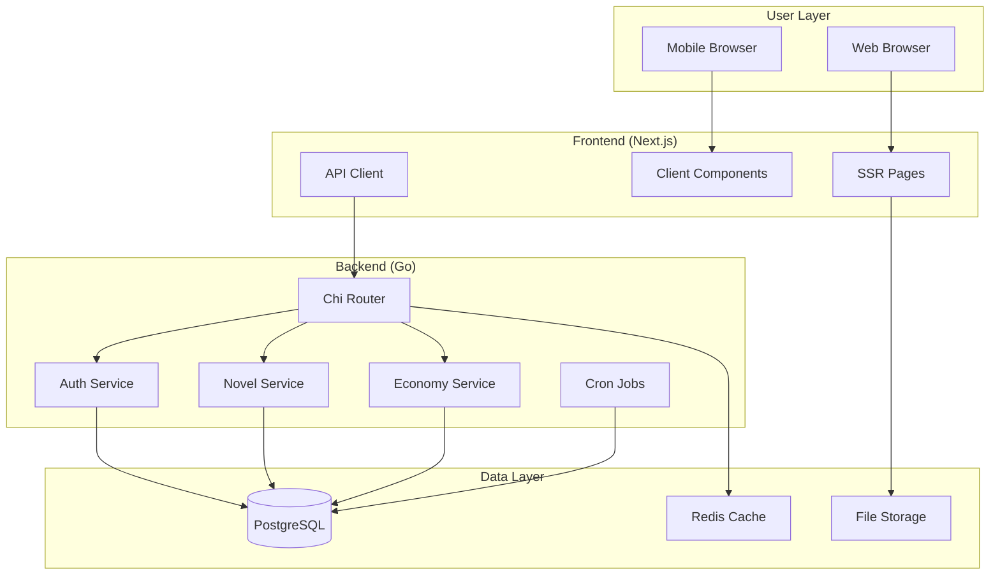
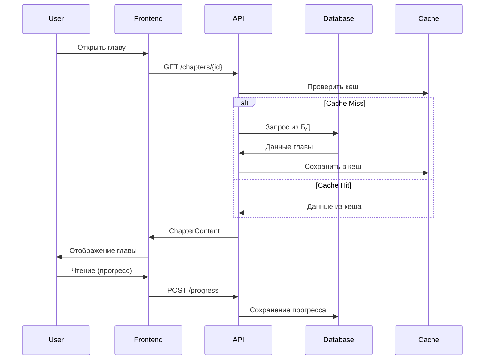

# Резюме проекта Novels - План реализации

## Краткий обзор

**Цель**: Создание многоязычной платформы для чтения новелл с экономической системой тикетов и комьюнити-функциями.

**Технологический стек**:
- Backend: Go + Chi Router + PostgreSQL
- Frontend: Next.js (React с SSR) + TypeScript
- Инфраструктура: Docker + PostgreSQL + Redis

**Уникальные особенности**:
- 🌍 Поддержка 7 языков интерфейса (ru, en, zh, ja, ko, fr, de)
- 🎯 SEO-оптимизированные страницы через SSR
- 💰 Экономическая система с тикетами и голосованиями
- 👥 Комьюнити-функции (комментарии, коллекции, вики-редактирование)
- 📱 Mobile-first responsive design

## Созданная документация

| Документ | Описание | Статус |
|----------|----------|--------|
| [`README.md`](../README.md) | Техническое задание и требования | ✅ Создан |
| [`DEVELOPMENT_PLAN.md`](../DEVELOPMENT_PLAN.md) | План разработки по этапам MVP | ✅ Создан |
| [`ARCHITECTURE.md`](../ARCHITECTURE.md) | Архитектурные решения и схемы | ✅ Создан |
| [`technical-implementation-plan.md`](technical-implementation-plan.md) | Детальный технический план | ✅ Создан |
| [`user-flow-diagrams.md`](user-flow-diagrams.md) | Диаграммы пользовательских потоков | ✅ Создан |
| [`api-specification.md`](api-specification.md) | Спецификация всех API эндпоинтов | ✅ Создан |
| [`ui-components-design-system.md`](ui-components-design-system.md) | Дизайн-система и UI компоненты | ✅ Создан |

## Этапы разработки

### 🏗️ ЭТАП A: MVP 1 - База платформы (Приоритет: КРИТИЧЕСКИЙ)

**Срок**: 4-6 недель  
**Задача**: Создать минимальный функционал для чтения новелл

**Ключевые компоненты**:
1. **Backend API** (Go + PostgreSQL)
   - Миграции БД и базовые модели
   - Система аутентификации (JWT)
   - CRUD для тайтлов и глав
   - Публичные API (каталог, поиск, ридер)

2. **Frontend** (Next.js + TypeScript)
   - SSR настройка с i18n
   - Главная страница (по дизайну)
   - Каталог с фильтрами
   - Страница тайтла с табами
   - Ридер глав (стиль ranobehub)
   - Базовый профиль
   - Админ-панель 

3. **Система прогресса чтения**

**Критерии готовности**: 
- ✅ Пользователь может найти новеллу → читать главы → прогресс сохраняется
- ✅ Админ может добавлять новеллы и главы  
- ✅ Работают 7 языков интерфейса
- ✅ SEO-страницы индексируются

### 👥 ЭТАП B: MVP 2 - Комьюнити (Приоритет: ВЫСОКИЙ)

**Срок**: 3-4 недели  

**Компоненты**:
- Nested комментарии (Reddit-style)
- Система закладок с фильтрами
- XP и уровни пользователей
- Расширенный профиль

**Критерии готовности**:
- ✅ Комментарии работают стабильно с модерацией
- ✅ Закладки с прогрессом и сортировкой
- ✅ XP корректно начисляется и отображается

### 💰 ЭТАП C: Economy Update (Приоритет: ВЫСОКИЙ)

**Срок**: 4-5 недель  

**Компоненты**:
- Система тикетов (Daily Vote, Novel Request, Translation Ticket)
- Cron начисления Daily Vote (03:00 МСК)  
- Предложка и голосование за новеллы
- Подписки и привилегии
- Защита от накрутки

**Критерии готовности**:
- ✅ Автоматические начисления Daily Vote
- ✅ Цикл предложка → голосование → автовыбор работает
- ✅ Подписки активируют все привилегии

### 🌟 ЭТАП D: Community Update (Приоритет: СРЕДНИЙ)

**Срок**: 3-4 недели  

**Компоненты**:
- Пользовательские коллекции
- Система новостей платформы
- Вики-редактирование через модерацию
- Абзацные комментарии (опционально)

## Первые шаги для команды

### 1. Настройка окружения разработки

```bash
# 1. Клонирование репозитория (после создания)
git clone https://github.com/your-org/novels.git
cd novels

# 2. Создание структуры проекта
mkdir -p backend frontend infra docs

# 3. Запуск инфраструктуры
docker-compose up -d postgres redis

# 4. Backend setup (Go)
cd backend
go mod init novels-backend
go get github.com/go-chi/chi/v5
go get github.com/lib/pq github.com/golang-jwt/jwt/v5

# 5. Frontend setup (Next.js)
cd ../frontend  
npx create-next-app@latest . --typescript --tailwind --app
npm install next-i18next react-query axios

# 6. Database setup
psql -h localhost -U novels -d novels < migrations/001_initial.sql
```

### 2. Распределение задач по ролям

**Backend Developer** (Go):
- [ ] Настройка Chi router и middleware
- [ ] Создание миграций PostgreSQL
- [ ] Реализация моделей данных
- [ ] JWT аутентификация 
- [ ] API эндпоинты для MVP 1

**Frontend Developer** (React/Next.js):  
- [ ] Настройка Next.js с SSR и i18n
- [ ] Создание дизайн-системы (Tailwind CSS)
- [ ] Базовые UI компоненты
- [ ] Главная страница по дизайну
- [ ] Каталог с фильтрами

**Fullstack/DevOps**:
- [ ] Docker конфигурация  
- [ ] CI/CD пайплайн
- [ ] Мониторинг и логирование
- [ ] Настройка продакшн окружения

### 3. Критические решения для принятия

**До начала разработки**:
1. ✅ **Домен и поддомены**: novels.com, api.novels.com  
2. ✅ **Хранение файлов**: Локально → S3-compatible позже
3. ✅ **Аналитика**: Google Analytics + кастомные события
4. ✅ **Мониторинг**: Prometheus + Grafana или готовые решения  
5. ✅ **Error tracking**: Sentry или аналоги
6. ✅ **CDN**: Cloudflare или AWS CloudFront

**Для Economy Update**:
- Интеграция платежей (Stripe, YooKassa, PayPal)
- Система уведомлений (email, push)
- Антифрод меры (device fingerprinting, CAPTCHA)

### 4. Метрики успеха

**MVP 1**:
- Time to First Read: < 30 секунд от регистрации
- Chapter Loading: < 2 секунды
- Search Response: < 500ms  
- Mobile Performance: Lighthouse Score > 85

**MVP 2**:
- User Engagement: > 60% возврат в течение недели
- Comments Activity: > 25% пользователей оставляют комментарии
- Bookmarks Usage: > 90% пользователей используют закладки

**Economy Update**:
- Daily Vote Usage: > 80% активных пользователей
- Subscription Conversion: > 5% пользователей  
- Voting Participation: > 30% в голосованиях

## Архитектурные диаграммы

### Общая архитектура системы


### Поток данных для чтения


## Следующие шаги

### Немедленные действия:
1. **Создать репозиторий** с начальной структурой
2. **Настроить Docker окружение** для разработки  
3. **Создать первые миграции БД** согласно схеме
4. **Инициализировать Go модуль** и Next.js проект
5. **Настроить CI/CD пайплайн** (GitHub Actions/GitLab)

### Первая неделя:
- [ ] Базовые модели данных (User, Novel, Chapter)
- [ ] JWT аутентификация
- [ ] Первые API эндпоинты (/auth, /novels)
- [ ] Next.js с i18n настройкой
- [ ] Дизайн-система (цвета, компоненты)

### Первый месяц:
- [ ] Полный MVP 1 функционал
- [ ] Тестовые данные в БД
- [ ] Базовые тесты
- [ ] Staging окружение
- [ ] Документация API (Swagger)

## Контакты и ресурсы

**Документация**:
- [Техническая спецификация API](api-specification.md)
- [UI Компоненты](ui-components-design-system.md)  
- [Пользовательские потоки](user-flow-diagrams.md)

**Полезные ресурсы**:
- [Go Chi Router](https://github.com/go-chi/chi)
- [Next.js i18n](https://nextjs.org/docs/advanced-features/i18n)
- [PostgreSQL Best Practices](https://wiki.postgresql.org/wiki/Don%27t_Do_This)
- [JWT Security](https://auth0.com/blog/a-look-at-the-latest-draft-for-jwt-bcp/)

**Референсы дизайна**:
- UI: Remanga.org (темная тема, карточки)
- Ридер: ranobehub.org (типографика, навигация)
- Комментарии: Reddit (nested структура)

---

План готов к реализации! Архитектурные решения продуманы, документация создана, этапы разработки четко определены. Можно переходить к кодированию MVP 1.