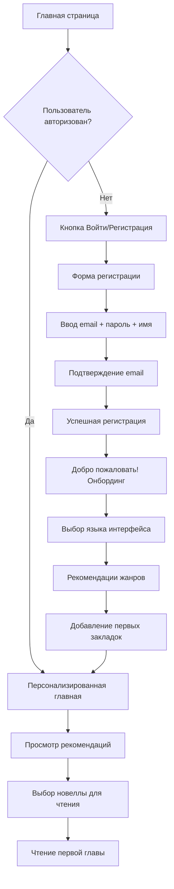
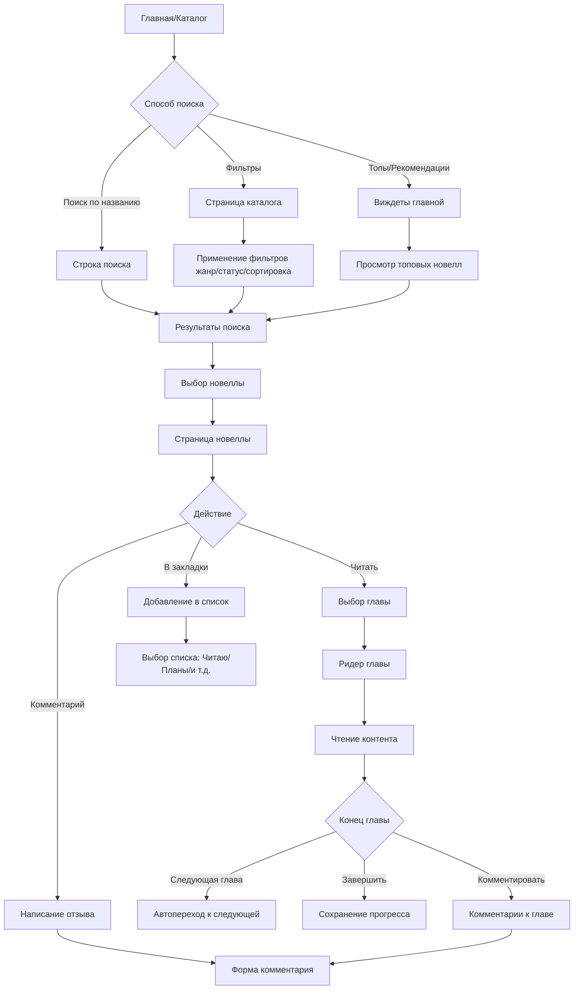
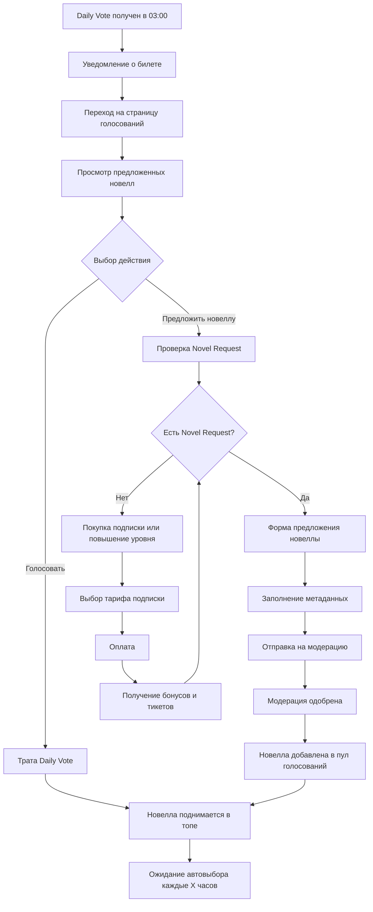
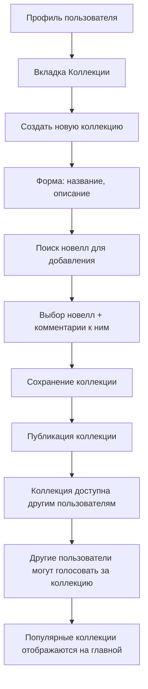
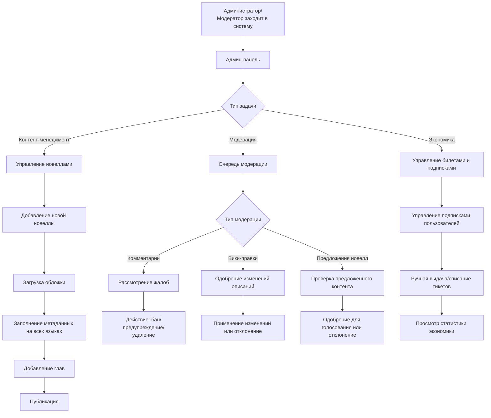
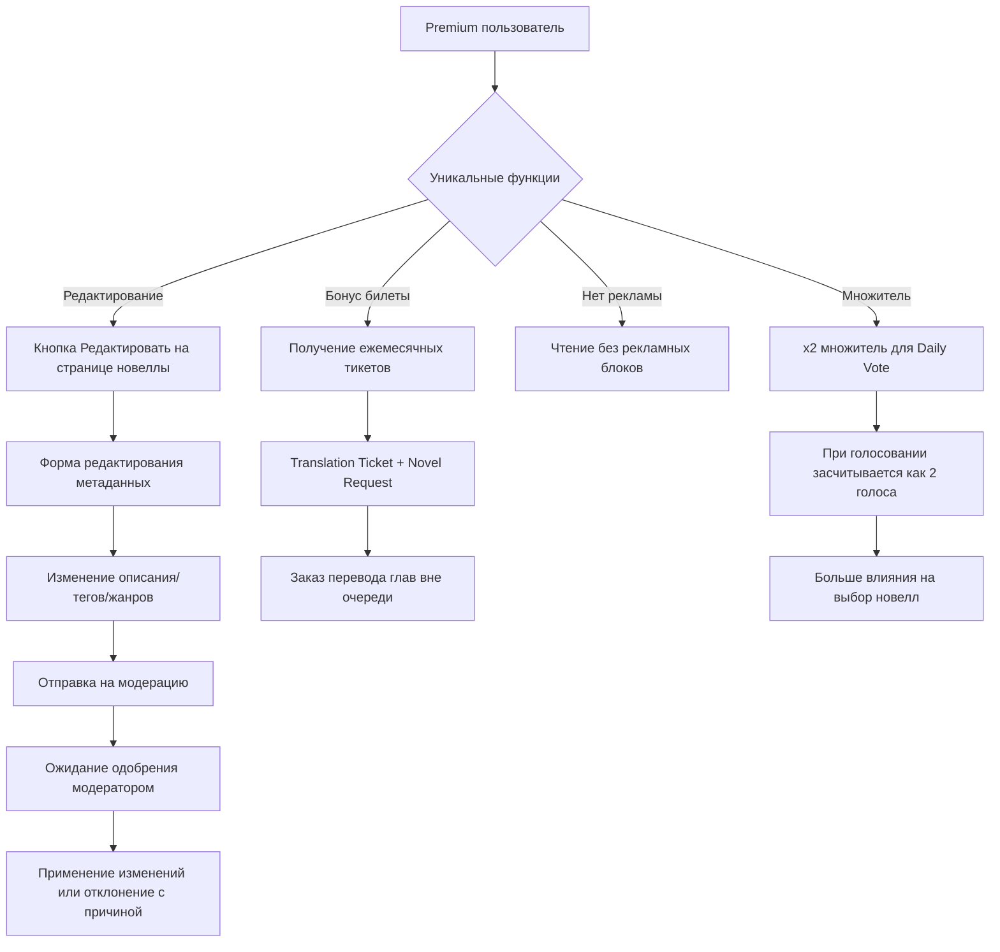

# Диаграммы пользовательских потоков (User Flow)

## Основные пользовательские сценарии

### 1. Поток регистрации и первого использования

### 2. Поток поиска и чтения новелл

### 3. Экономический поток (тикеты и голосования)

### 4. Поток создания коллекций

### 5. Поток модерации и администрирования

### 6. Поток Premium пользователя

## Критические точки UX

### 1. Онбординг новых пользователей
- **Проблема**: Пользователь может быть перегружен количеством функций
- **Решение**: Пошаговый тур с фокусом на основные функции (поиск → чтение → закладки)

### 2. Экономическая система
- **Проблема**: Сложность понимания тикетов и их использования
- **Решение**: Четкие объяснения + туториал + визуальные подсказки

### 3. Мультиязычность
- **Проблема**: Переключение языков может сбросить контекст
- **Решение**: Сохранение текущей страницы при смене языка + локализация URL

### 4. Мобильная версия
- **Проблема**: Сложная навигация на маленьких экранах
- **Решение**: Mobile-first подход + упрощенная навигация + жесты

## Метрики успеха для каждого потока

### Регистрация и активация
- Конверсия регистрации: >15%
- Завершение онбординга: >70%
- Активность в первые 7 дней: >40%

### Чтение контента
- Время чтения за сессию: >15 минут
- Возврат к чтению в течение недели: >60%
- Среднее количество прочитанных глав за месяц: >10

### Экономическая активность  
- Использование Daily Vote: >80% активных пользователей
- Конверсия в подписку: >5%
- Активность в голосованиях: >30% пользователей

### Комьюнити-функции
- Пользователи с закладками: >90%
- Пользователи оставляющие комментарии: >25%
- Создание коллекций: >10% активных пользователей

Эти потоки помогут разработчикам и дизайнерам понять, как пользователи будут взаимодействовать с платформой, и выявить потенциальные проблемы на раннем этапе.